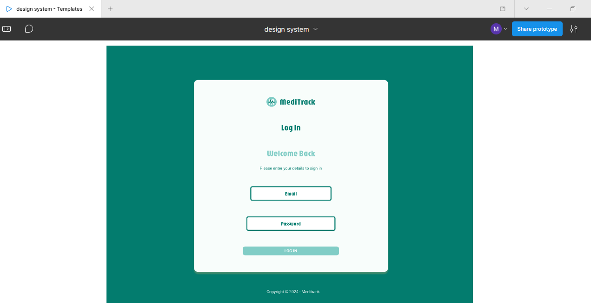
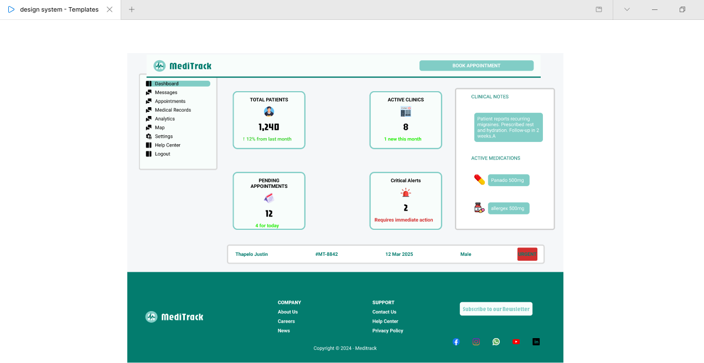
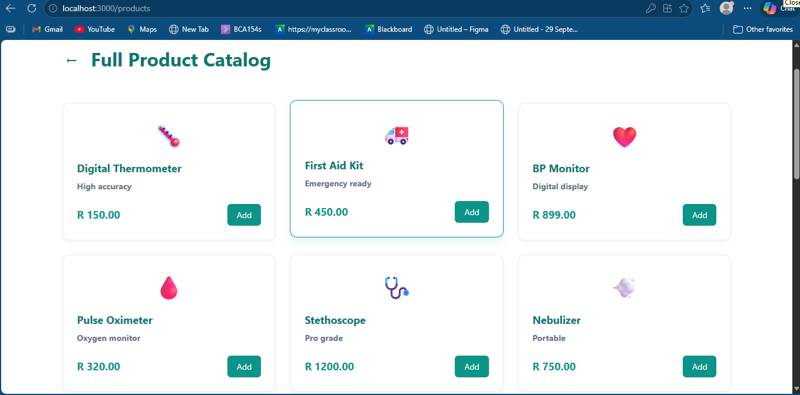
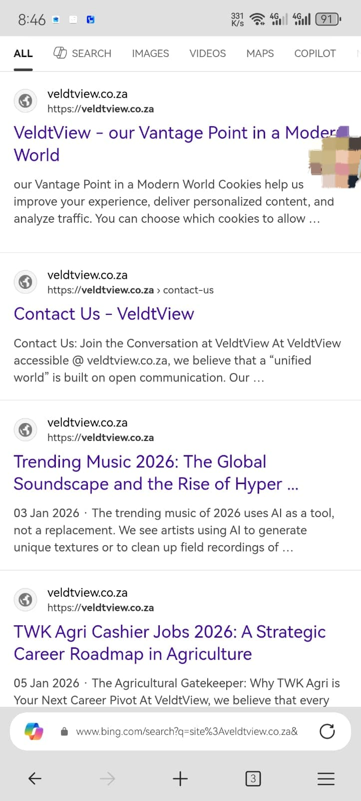
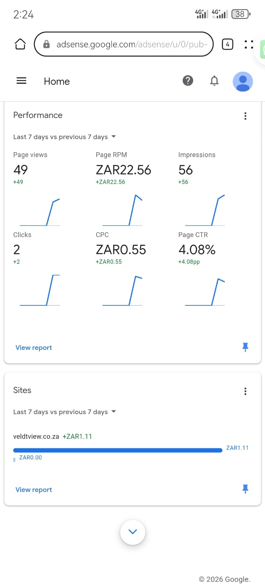

# 💼 MY PORTFOLIO
## 👋 Hi, I'm Thapelo Justin Masingi
### 🚀 Full-Stack Web Developer & Digital Marketer

  
  
  

---

## 👨‍💻 ABOUT ME
I am an Information and Communication Technology (ICT) student at the Cape Peninsula University of Technology (CPUT), specializing in Multimedia Applications. I am deeply passionate about web development and digital marketing. I love building digital solutions that actually make life easier, and I am a natural problem-solver who enjoys bridging the gap between clean code and great user experiences.

---

## 🎯 MY VISION & GOALS
* **My Vision:** To bridge the gap between complex coding and intuitive user design by building inclusive, accessible, and high-performing digital solutions for everyday problems.
* **My Goals:** My primary career goal is to evolve into a Web Developer Specialist. I aim to master both front-end aesthetics and back-end architecture to lead innovative digital projects in the ICT industry.

---

## 🛠️ TECH STACK

### 💻 Development

### 🗄️ Database

### 🎨 Tools

---

## 💡 PROJECTS

### 1. MediTrack (2025)
**Role:** Project Lead  
**Description:** Conceptualized a health application designed to shorten healthcare queues by handling appointments and medical administrative tasks online.

#### 📸 Design Evidence (Figma UI/UX)

| Login Page Mockup | Dashboard Interface |
|------------------|--------------------|
|  |  |

#### ⚙️ Technical Development (React)

---

### 2. Circuit SA (2025 - Present)
**Role:** Lead Developer & Creator  
**Description:** A platform providing information about bursaries and learnerships in South Africa. Developed using WordPress to ensure seamless cross-browser compatibility and accessibility for students on all devices.

---

### 3. VeldtView 
**Role:** Lead Developer & Creator  
**Description:** A multimedia web platform. Leveraged CMS frameworks to manage multimedia content, ensuring the platform remains high-performing across different web browsers.

#### 📸 Performance & SEO Evidence

| Search Visibility (SEO) | AdSense Performance |
|------------------------|--------------------|
|  |  |

---

### 4. Style Mentor (2024)
**Role:** Co-Designer  
**Description:** A collaborative project aimed at diversifying learning styles by offering different types of educational content for students.

---

## ✍️ REFLECTIONS (STAR METHOD)

### 📘 Coding in Markdown
**Situation:** I needed to convert my professional CV into a web-ready format for my digital portfolio assessment.  
**Task:** The goal was to use Markdown syntax to ensure my technical skills and projects were structured correctly for a GitHub environment.  
**Action:** I utilized headers, bold text, and tables to create a clean and readable layout.  
**Result:** I successfully created a professional portfolio that clearly presents my work and skills.

---

### 🎤 Mock Interview Experience
**Situation:** I recorded a mock interview to simulate a real job interview.  
**Task:** I needed to present myself professionally and answer questions clearly within a time limit.  
**Action:** I prepared by reviewing my projects and practiced answering questions using the STAR method.  
**Result:** This improved my confidence and communication skills for real interview situations.

---

### 🌐 GitHub Pages Deployment
**Situation:** I needed to publish my portfolio online.  
**Task:** My objective was to deploy my repository using GitHub Pages.  
**Action:** I configured my repository and enabled GitHub Pages from the main branch.  
**Result:** My portfolio is now live and accessible, showcasing my work professionally.

---

### 🤝 Graduate Attributes: Ubuntu
**Situation:** Many students struggle to find bursary information.  
**Task:** I wanted to use my skills to help solve this problem.  
**Action:** I developed Circuit SA to provide accessible information.  
**Result:** The platform helps students access opportunities more easily.

---

## 📄 CURRICULUM VITAE (CV)

### PERSONAL DETAILS
* **Full Name:** Thapelo Justin Masingi  
* **Address:** 10 Dorset Str, Woodstock CPT  
* **Contact Number:** 0647010896  
* **Student Email:** 223050717@MYCPUT.AC.ZA  

---

### CAREER OBJECTIVES
I'm an ICT student specialising in Multimedia Applications with a focus on Web Development and Digital Marketing. I am seeking a Work Integrated Learning (WIL) opportunity to gain industry experience.

---

### EDUCATION
**National Diploma: Information Technology**  
*Cape Peninsula University of Technology (CPUT) | Expected Graduation 2026*  

**National Senior Certificate (Matric)**  
*Michael Denga Ramabulana Secondary School | 2021*  

---

### REFERENCES
* Meagan Danielle Hamman – HAMMANM@cput.ac.za  
* Thurlo Dean Cicero – cicerot@cput.ac.za  

---

## 🎥 MOCK INTERVIEW 
<video controls width="100%">
  <source src="0330.mp4" type="video/mp4">
</video>

---

  ⭐ Thank you for viewing my portfolio  

