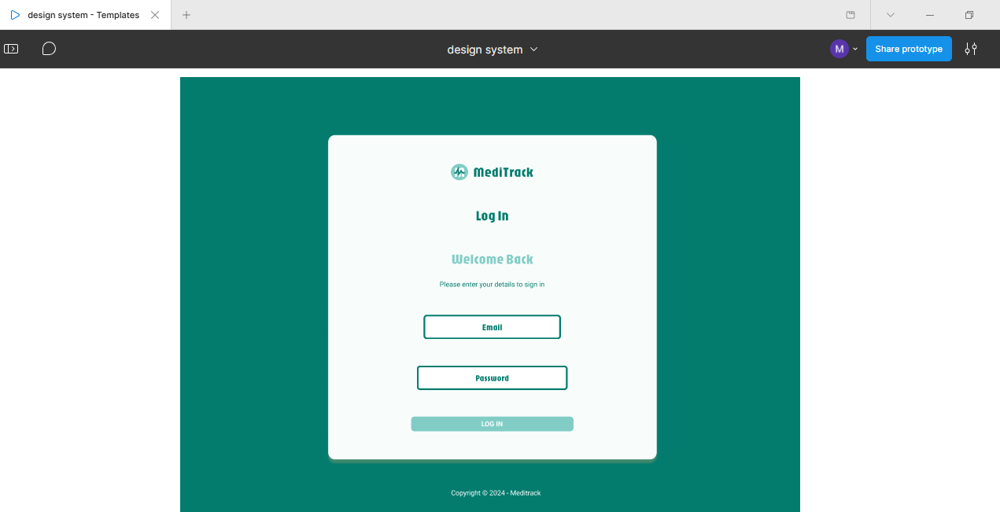
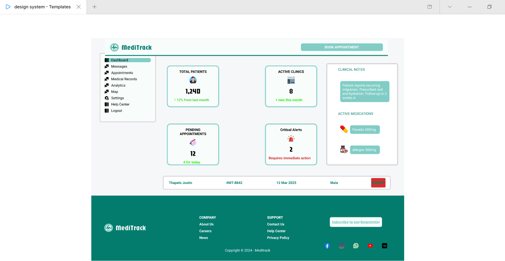
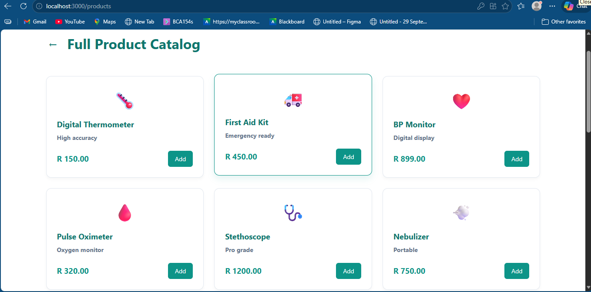
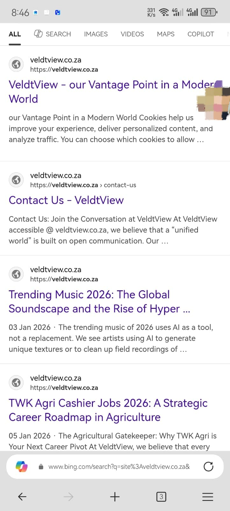
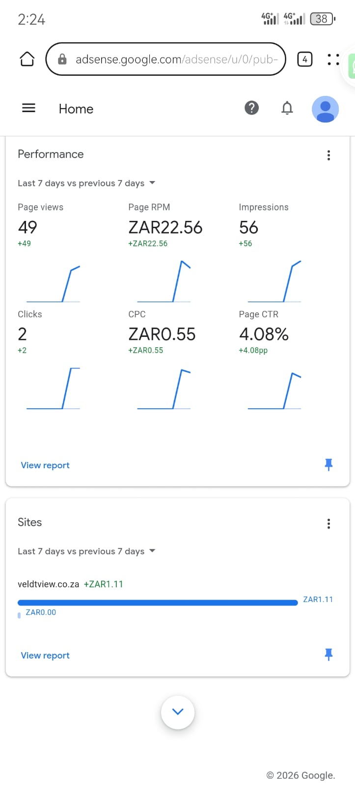

# 💼 MY PORTFOLIO
## 👋 Hi, I'm Thapelo Justin Masingi
### 🚀 Full-Stack Web Developer | Multimedia Creative | Digital Marketer

  
  
  

Passionate about building digital experiences that combine clean code, creativity, and meaningful impact.

📍 Cape Town, South Africa | 🎓 ICT Multimedia Student at CPUT | 🌱 Growing in React & Full-Stack Development

---

## 🔗 CONNECT WITH ME

💼 LinkedIn: www.linkedin.com/in/thapelo-masingi

💻 GitHub: https://github.com/thapelo262

📧 Email: 223050717@mycput.ac.za

---

## 🚀 OPEN TO

✔ Work Integrated Learning (WIL)

✔ Junior Developer Opportunities

✔ Collaboration Projects

✔ Freelance Opportunities

---

## 👨‍💻 ABOUT ME

I’m an Information and Communication Technology (ICT) student at the Cape Peninsula University of Technology (CPUT), specialising in Multimedia Applications with a strong focus on Full-Stack Development and Digital Marketing.

I enjoy creating digital solutions that solve practical problems and improve everyday experiences. My multimedia background allows me to combine design thinking with technical development to create experiences that are functional, accessible, and visually engaging.

I enjoy bridging the gap between design and development by creating solutions that not only work well but also feel intuitive and user-friendly.

Currently, I am actively seeking a Work Integrated Learning (WIL) opportunity where I can contribute, grow, and learn from industry professionals.

---

## 🎯 MY MISSION

To create digital experiences that combine technology and creativity while improving accessibility and solving real-world challenges.

---

## 🌟 WHAT DRIVES ME

✔ Solving real-world problems

✔ Building user-focused experiences

✔ Continuous learning

✔ Combining creativity with technology

✔ Creating meaningful impact

---

## 💡 WHAT I BRING

🚀 Full-Stack Development mindset

🎨 Multimedia & UI/UX background

📈 SEO & Digital Marketing awareness

🤝 Collaboration and communication

🧠 Fast learner & problem solver

📱 Accessibility-first thinking

---

## 🎓 GITHUB EDUCATION

As a CPUT student, I make use of GitHub's educational ecosystem to support my learning journey and access industry-standard development tools.

GitHub Education allows students to gain practical experience with technologies used in professional environments while strengthening development workflows and portfolio presentation.

*(Insert GitHub Student Developer Pack screenshot if available)*

---

## 🛠️ TECH STACK

### 💻 Development

### 🗄️ Database

### 🎨 Tools

---

## 📚 CURRENTLY LEARNING

🌱 MERN Stack Development

🌱 API Integration

🌱 Backend Architecture

🌱 Advanced React Patterns

🌱 Technical SEO

---

## 💡 PROJECTS

### 1. MediTrack (2025)

**Role:** Project Lead

**Description:** Designed a healthcare-focused platform aimed at reducing waiting times by handling appointments and administrative tasks digitally.

**Skills Applied:**

✔ UI/UX Design

✔ React Development

✔ User Research

✔ Problem Solving

#### 📸 Design Evidence (Figma UI/UX)

| Login Page Mockup | Dashboard Interface |
|------------------|--------------------|
|  |  |

#### ⚙️ Technical Development (React)

---

### 2. Circuit SA (2025 – Present)

**Role:** Lead Developer & Creator

A platform designed to improve access to bursaries and learnership opportunities for students across South Africa.

Skills:

✔ WordPress

✔ SEO

✔ Information Architecture

✔ Accessibility

---

### 3. VeldtView

**Role:** Lead Developer & Creator

Multimedia platform optimized for accessibility, performance, and search visibility.

#### 📸 Performance & SEO Evidence

| Search Visibility | Analytics |
|------------------|-----------|
|  |  |

---

### 4. Style Mentor (2024)

**Role:** Co-Designer

A collaborative project focused on supporting different learning styles through educational content experiences.

---

## 📈 MY DEVELOPMENT JOURNEY

I believe growth happens through building and learning publicly.

Each project teaches me something new — whether debugging React applications, refining accessibility, or improving user experience.

I enjoy documenting that process because growth creates opportunities for collaboration and improvement.

---

## ✍️ REFLECTIONS

### 📘 Coding in Markdown

**Situation:** Needed to convert my CV into a web-friendly portfolio.

**Task:** Present information in a clean and professional way.

**Action:** Used Markdown formatting with structured layouts and reusable components.

**Result:** Created a portfolio that presents information clearly and professionally.

---

### 🎤 Mock Interview Experience

**Situation:** Participated in a mock interview simulation.

**Task:** Improve confidence and communication.

**Action:** Practiced project explanations and professional responses.

**Result:** Improved confidence and interview readiness.

---

## 🎥 MOCK INTERVIEW

Click below to watch:

[▶ Watch Mock Interview](0330.mp4)

---

### 🌐 GitHub Pages Deployment

**Situation:** Needed to make my portfolio publicly accessible.

**Task:** Deploy a professional online portfolio.

**Action:** Configured GitHub Pages and optimized content structure.

**Result:** Successfully launched an accessible digital portfolio.

---

## 🌐 LIVE PORTFOLIO

Portfolio Link:

https://YOURUSERNAME.github.io/portfolio

---

## 📄 CURRICULUM VITAE (CV)

### PERSONAL DETAILS

👤 Full Name: Thapelo Justin Masingi

📍 Cape Town, South Africa

📞 0647010896

📧 223050717@mycput.ac.za

---

### CAREER OBJECTIVE

I’m an ICT Multimedia student specialising in Full-Stack Development and Digital Marketing seeking a Work Integrated Learning opportunity where I can contribute and continue growing professionally.

---

### CORE COMPETENCIES

✔ Full-Stack Development

✔ UI/UX Design

✔ SEO Optimization

✔ Team Collaboration

✔ Problem Solving

✔ Responsive Design

✔ Digital Marketing

---

### EDUCATION

**National Diploma: Information Technology**

Cape Peninsula University of Technology

Expected Graduation: 2026

**National Senior Certificate**

Michael Denga Ramabulana Secondary School

Completed: 2021

---

### REFERENCES

Meagan Danielle Hamman

HAMMANM@cput.ac.za

Thurlo Dean Cicero

cicerot@cput.ac.za

---

⭐ Thank you for visiting my portfolio

Let's build something meaningful together 🚀

